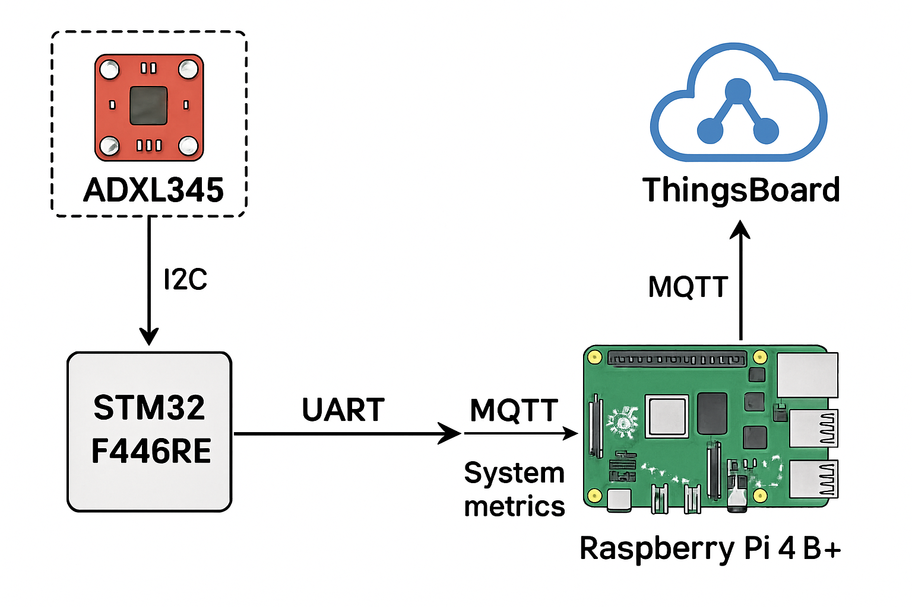
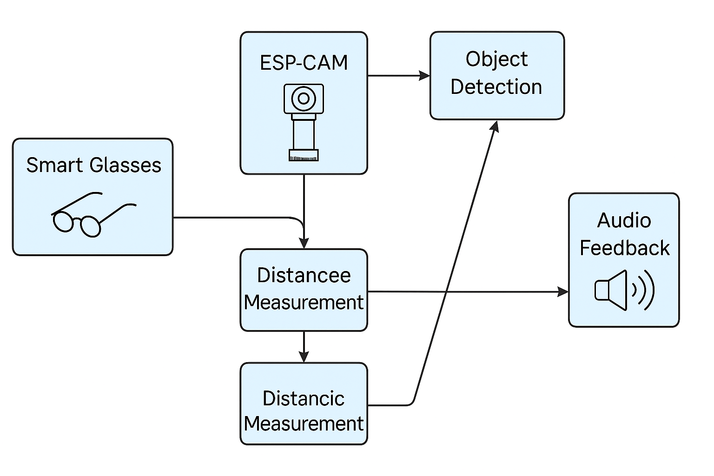

# Integrated Data Transmission & Visualization System  
## STM32 Nucleo-F446RE + ADXL345 + Raspberry Pi MQTT Stack  
**Author:** Abhijit Rai  
**Institution:** Army Institute of Technology, Pune  
**Guided by:** Prof. Renuka Bhandari  
**Date:** July 2025  
**Category:** Project-Based Learning | Embedded Systems  

---

## Executive Summary

This project presents a robust, modular data acquisition and transmission system combining the strengths of an STM32 Nucleo-F446RE microcontroller, an ADXL345 3-axis accelerometer, and a Raspberry Pi 4B+. The solution integrates low-level I2C and UART drivers, real-time telemetry streaming over MQTT, and live data visualization through ThingsBoard and Processing IDE.

It’s designed for learning, experimentation, and extension—building foundational experience in embedded data pipelines, custom driver integration, and scalable IoT architecture.

---

## System Overview

### STM32 Nucleo-F446RE  
- Interfaces with ADXL345 via I2C (Fast Mode)  
- Acquires real-time accelerometer data (X, Y, Z axes)  
- Communicates over UART with Raspberry Pi for data offloading  
- Implements custom HAL-compatible driver in C  
- Handles peripheral initialization and basic processing on bare-metal  

### Raspberry Pi 4B+  
- Hosts a Python MQTT client for telemetry publication  
- Captures UART packets from STM32 and forwards to ThingsBoard Cloud  
- Collects system metrics (CPU, RAM, disk) for diagnostics  
- Supports optional 3D visualization via Processing IDE  

---

## Hardware Specifications

| Component               | Functionality                                      |
|------------------------|---------------------------------------------------|
| STM32 Nucleo-F446RE    | Core MCU for sensor interfacing and data formatting |
| ADXL345 Accelerometer  | 3-axis motion detection over I2C                   |
| Raspberry Pi 4B+       | System monitor + MQTT publisher                    |
| UART Interface          | STM32 ↔ Raspberry Pi serial link (USART2 @ 115200 baud) |
| I2C Interface           | STM32 ↔ ADXL345 (Pins PB8, PB9, Fast Mode)         |

**Note:** Pull-up resistors are recommended on the I2C lines to maintain signal integrity.

---

## System Architecture

The system consists of multiple hardware and software modules integrated for real-time data acquisition, processing, and communication.

This diagram shows how components like ADXL345, STM32F4, and Raspberry Pi interact across I²C, UART, and MQTT protocols.



### Overall Data Flow
This flowchart captures the complete signal flow — from sensor input, microcontroller preprocessing, to Raspberry Pi processing and final cloud integration.




# STM32 + ADXL345 + MQTT + 3D Visualizer

A real-time embedded sensor telemetry project that integrates an ADXL345 accelerometer with an STM32F446RE microcontroller, transmitting motion data to a Raspberry Pi via UART. Data is published to ThingsBoard over MQTT and visualized using a 3D tilt interface built in Processing.

---

##  Project Repository Structure

| Path                          | Description                                               |
|------------------------------|-----------------------------------------------------------|
| `main_py_sendUARTdata.py`    | Python script for UART acquisition and MQTT publishing    |
| `acc_ADXL.pde`               | Processing IDE sketch for 3D tilt visualization            |
| `pi4_dashboard_mqtt.json`    | Dashboard template for ThingsBoard                        |
| `Core/Src/ADXL345.c`         | ADXL345 driver implementation (C source)                  |
| `Core/Inc/ADXL345.h`         | ADXL345 header declarations                               |
| `Core/Src/main.c`            | Application logic: peripheral setup, sensor read, UART TX |

---

##  Feature Highlights

- **Lightweight ADXL345 I2C Driver**: Custom built for STM32 HAL framework  
- **Real-Time UART Transmission**: Enables live sensor data monitoring  
- **Cloud Telemetry**: Publishes sensor + system metrics via MQTT  
- **3D Visualization**: Simulates tilt motion using Processing in real-time  
- **Modular Driver Architecture**: Portable, clean, and maintainable  

---

##  Software & Hardware Setup

### Hardware Connections

**ADXL345 → STM32F446RE**

| ADXL345 Pin | STM32 Pin |
|-------------|-----------|
| VCC         | 3.3V      |
| GND         | GND       |
| SDA         | PB9       |
| SCL         | PB8       |

**STM32F446RE → Raspberry Pi**

| STM32 Pin | Pi Function |
|-----------|-------------|
| PA2 (Tx)  | UART Rx     |
| PA3 (Rx)  | UART Tx     |

---

### Software Dependencies

- STM32CubeIDE for embedded development  
- Python 3.x on Raspberry Pi  
- `paho-mqtt` Python package  
- ThingsBoard (local or cloud-hosted)  
- Processing IDE for 3D simulation  

---

## STM32 Firmware Usage

### Key Functions in `ADXL345.c`

- `ADXL345_Init()` — Initializes ADXL registers for measurement  
- `TT_GET_ACCELERATIONS()` — Fetches raw X, Y, Z data from sensor  

### Sample Main Loop

```c
#include "ADXL345.h"

MX_I2C1_Init();
MX_USART2_UART_Init();
ADXL345_Init();

while (1) {
    float x_acc, y_acc, z_acc;

    TT_GET_ACCELERATIONS(&x_acc, &y_acc, &z_acc);
    printf("X: %f, Y: %f, Z: %f\n", x_acc, y_acc, z_acc);

    HAL_Delay(500);
}
```

---

## Raspberry Pi Instructions

### Install MQTT Library

```bash
pip install paho-mqtt
```

### Run UART to MQTT Publisher

```bash
python3 main_py_sendUARTdata.py
```

### Import Dashboard in ThingsBoard

1. Log in to ThingsBoard  
2. Navigate to **Dashboards → Import JSON**  
3. Upload `pi4_dashboard_mqtt.json`  
4. Bind telemetry fields and widgets  

---

##  Real-Time Performance & Metrics

- **Sampling Rate**: ~10 Hz  
- **Data Latency**: ~50–150 ms  
- **System Metrics Monitored**:
  - CPU temperature
  - RAM usage
  - Disk health  
- **Visual Feedback**:
  - LED toggle logic (extendable)
  - Real-time 3D plane tilt (Processing sketch)  

---

##  Future Enhancements

- **Interrupt-Based Sampling** using ADXL345 INT1/INT2  
- **Bi-Directional MQTT** for remote control using RPC  
- **Edge AI Filtering** for anomaly detection  
- **Sensor Expansion** over SPI or I2C for more data  

---

##  References

- [ADXL345 Datasheet – Analog Devices](https://www.analog.com/media/en/technical-documentation/data-sheets/ADXL345.pdf)  
- [STM32 Nucleo-F446RE Board Docs](https://www.st.com/en/evaluation-tools/nucleo-f446re.html)  
- [STM32Cube HAL API Reference](https://www.st.com/en/embedded-software/stm32cubeembedded-software.html)  
- [ThingsBoard Documentation](https://thingsboard.io/docs/)  
- [Processing Language Reference](https://processing.org/reference/)  

---

## Credits

This project was developed by **Abhijit Rai** as part of a Project-Based Learning (PBL) initiative under the guidance of **Prof. Renuka Bhandari**, Department of Electronics & Telecommunication, Army Institute of Technology, Pune.

Special thanks to the open-source embedded systems community for libraries and reference implementations that accelerated this project.

---
